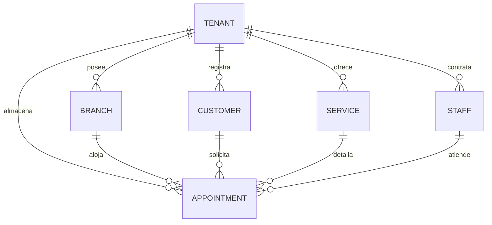
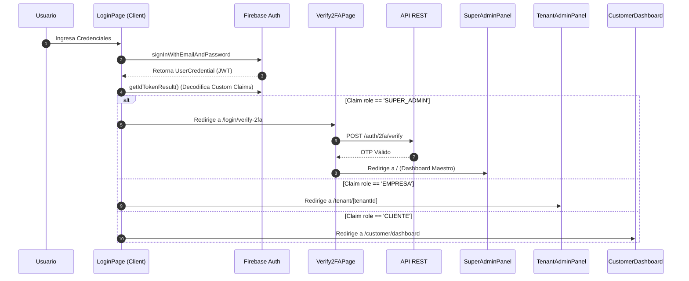
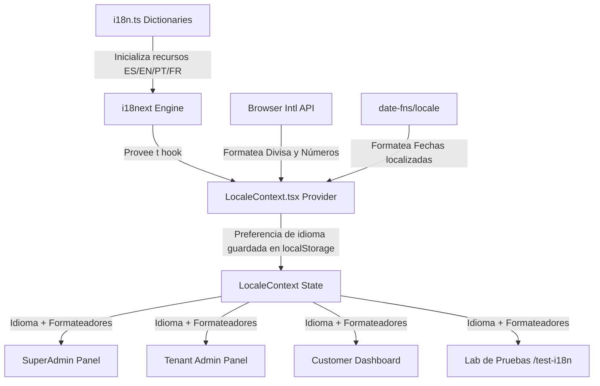

# Glamy SaaS — Sistema Multi-Tenant de Gestión para Salones de Belleza


<p align="center">
  <strong>UNIVERSIDAD LA SALLE</strong><br/>
  Facultad de Ingenierías y Arquitectura<br/>
  Carrera Profesional de Ingeniería de Software
</p>

<p align="center">
  <strong>ASIGNATURA:</strong> Ingeniería Web<br/>
  <strong>PROFESOR:</strong> Richart Smith Escobedo Quispe<br/>
  <strong>AÑO:</strong> 2026 — Semestre VII
</p>

<p align="center">
  <strong>INTEGRANTES:</strong><br/>
  • Mares Graos Frederick Dicarlo<br/>
  • Flores Vera Gustavo Alexander<br/>
  • Saya Ramos Arnold Daniel<br/>
  • Ortiz Rosas Joshua David
</p>

<p align="center">
  <strong>Stack Tecnológico:</strong> Node.js (v22) | NestJS (v11) | Next.js (v16) | Firebase (Auth & Firestore)
</p>

---

## 📋 Tabla de Contenidos

1. [Descripción del Proyecto](#1-descripción-del-proyecto)
2. [Descripción de Interfaces (UI Showcase)](#2-descripción-de-interfaces-ui-showcase)
3. [Tecnologías Utilizadas y Explicación de Librerías](#3-tecnologías-utilizadas-y-explicación-de-librerías)
4. [Estructura de Directorios del Proyecto](#4-estructura-de-directorios-del-proyecto)
5. [Instalación y Configuración del Backend (NestJS)](#5-instalación-y-configuración-del-backend-nestjs)
6. [Instalación y Configuración del Frontend (Next.js)](#6-instalación-y-configuración-del-frontend-nextjs)
7. [Arquitectura de Seguridad (Custom Claims y Reglas de Firestore)](#7-arquitectura-de-seguridad-custom-claims-y-reglas-de-firestore)
8. [Seguridad Avanzada: Autenticación de Doble Factor (2FA - TOTP)](#8-seguridad-avanzada-autenticación-de-doble-factor-2fa---totp)
9. [Modelo de Datos (NoSQL Firestore)](#9-modelo-de-datos-nosql-firestore)
10. [Endpoints de la API REST](#10-endpoints-de-la-api-rest)
11. [Componentes del Frontend y Flujo de Autenticación](#11-componentes-del-frontend-y-flujo-de-autenticación)
12. [Guía de Pruebas REST con SoapUI](#12-guía-de-pruebas-rest-con-soapui)
13. [Despliegue en la Nube (Hosting y Serverless Functions)](#13-despliegue-en-la-nube-hosting-y-serverless-functions)
14. [Práctica: Internacionalización (i18n) y Localización (l10n)](#14-práctica-internacionalización-i18n-y-localización-l10n)
15. [Rúbrica de Calificación (Práctica de i18n y l10n)](#15-rúbrica-de-calificación-práctica-de-i18n-y-l10n)
16. [Conclusiones](#16-conclusiones)
17. [Roadmap de Desarrollo Futuro](#17-roadmap-de-desarrollo-futuro)
18. [Enlaces de Interés](#18-enlaces-de-interés)

---

## 1. Descripción del Proyecto

**Glamy SaaS** es un ecosistema digital multi-tenant diseñado para automatizar y administrar de manera centralizada salones de belleza, barberías y centros de estética. Bajo un modelo de Software as a Service (SaaS), la plataforma permite aislar los datos de cada salón de belleza (tenant) a la vez que provee herramientas globales de administración.

### Características Clave
- **Aislamiento Multi-Tenant:** Cada salón de belleza administra sus propios recursos (sucursales, personal, catálogos de servicios, clientes y reservas).
- **Esquema de Suscripciones:** Soporte nativo para planes `STARTUP`, `PRO` y `ENTERPRISE`.
- **Autenticación Basada en Roles con Requisitos de Seguridad:** SuperAdmin (con 2FA obligatorio por TOTP), Empresa (acceso al panel de control específico del tenant) y Cliente (wizard interactivo de reservas).
- **Operaciones en Cascada:** Al suspender o eliminar un tenant, el sistema propaga la acción a todos los recursos dependientes utilizando transacciones por lotes en la base de datos Firestore.

### 👥 Roles del Sistema

| Rol | Distintivo | Acceso | Descripción |
|-----|------------|--------|-------------|
| **SUPER_ADMIN** | `bg-red-500` | Panel Global Maestro | Administra todas las empresas, monitorea KPIs, gráficos distributivos de planes, y genera nuevas cuentas empresariales con credenciales temporales. Requiere 2FA. |
| **EMPRESA** | `bg-blue-500` | Panel Administrativo por Tenant | Controla sucursales, horarios, personal asignado, listado de clientes, catálogos de servicios y programación de citas específicas de su organización. |
| **CLIENTE** | `bg-green-500` | Portal de Reservas | Registro de datos de contacto y asistente (wizard) interactivo de programación de reservas en 6 pasos. |

---

## 2. Descripción de Interfaces (UI Showcase)

En esta sección se detallan las vistas clave de la aplicación en producción.

### 2.1 Panel SuperAdmin (Dashboard Global)
* **Visualización de Métricas:** Panel interactivo para monitoreo de KPIs globales como total de ingresos y distribución de planes.
* **Gráficos Estadísticos:** Uso de la librería Recharts para renderizar gráficos de barra dinámicos.
* **Gestión de Tenants:** Tabla interactiva para dar de alta, modificar, suspender o eliminar tenants, con opción de exportación a CSV.

### 2.2 Portal de Clientes (Wizard de Reservas)
* **Wizard de 6 Pasos:** Asistente interactivo guiado paso a paso para la programación de reservas.
* **Selección Dinámica:** Permite al cliente seleccionar el salón de belleza (tenant), la sede, el servicio, el estilista/personal y el horario de atención.
* **Confirmación e Historial:** Resumen final de la cita y acceso directo al historial de reservas del usuario.

---

## 3. Tecnologías Utilizadas y Explicación de Librerías

### 3.1 Stack General
- **Backend Framework:** NestJS (v11) con adaptador Express.
- **Frontend Framework:** Next.js (v16) con App Router y renderizado híbrido.
- **Runtime:** Node.js (v22).
- **Base de Datos NoSQL:** Google Cloud Firestore (Serverless).
- **Autenticación:** Firebase Authentication con Custom Claims.
- **Estilos:** TailwindCSS (v4) con PostCSS.

### 3.2 Librerías del Backend (`backend/package.json`)

| Librería | Versión | Explicación |
|----------|---------|-------------|
| `@nestjs/common` | ^11.0.1 | Módulo principal que provee decoradores de inyección de dependencias (`@Injectable()`, `@Controller()`, etc.). |
| `@nestjs/core` | ^11.0.1 | Núcleo del framework NestJS para control de ciclo de vida de la aplicación. |
| `@nestjs/platform-express` | ^11.0.1 | Adaptador para integrar NestJS sobre el servidor HTTP Express. |
| `firebase-admin` | ^13.8.0 | SDK servidor de Firebase para comunicarse con Firestore y administrar claims JWT. |
| `firebase-functions` | ^7.2.5 | SDK para crear Cloud Functions v2 y empaquetar la API de NestJS como serverless. |
| `class-validator` / `class-transformer` | ^0.15.1 / ^0.5.1 | Validación declarativa de DTOs en las peticiones REST. |
| `otplib` | ^13.4.0 | Generador y verificador de códigos TOTP de 6 dígitos para la seguridad del 2FA. |
| `cors` | ^2.8.6 | Habilita el intercambio de recursos de origen cruzado para conectar el Frontend. |

### 2.3 Librerías del Frontend (`frontend/package.json`)

| Librería | Versión | Explicación |
|----------|---------|-------------|
| `next` | 16.2.6 | Framework web de React con enrutamiento basado en archivos. |
| `react` / `react-dom` | 19.2.4 | Librería base para la interfaz reactiva. |
| `firebase` | ^12.13.0 | SDK cliente para autenticar usuarios directamente desde el navegador. |
| `lucide-react` | ^1.14.0 | Iconografía SVG ligera e interactiva. |
| `recharts` | ^3.8.1 | Renderizado de gráficos de barra D3 para visualización de KPIs. |
| `i18next` / `react-i18next` | ^23.14 / ^14.1 | Motor de internacionalización y hooks de traducción reactivos. |
| `date-fns` | ^3.6.0 | Formateador localizado de fechas regionales en base al idioma activo. |

---

## 4. Estructura de Directorios del Proyecto

El proyecto está organizado en una arquitectura de monorrepositorio dividido en `backend/` y `frontend/`.

```
glamyprojec/
├── firebase.json               # Configuración del despliegue serverless de Firebase
├── .firebaserc                 # Configuración del proyecto de destino en Firebase
├── backend/                    # --- BACKEND (NestJS API) ---
│   ├── firebase-debug.log
│   ├── package.json
│   ├── tsconfig.json
│   └── src/
│       ├── main.ts             # Punto de arranque o exportación de la Cloud Function
│       ├── app.module.ts       # Módulo raíz de la aplicación
│       ├── auth/               # Guardias de seguridad y TOTP
│       │   ├── auth.guard.ts   # Verificación JWT de Firebase
│       │   └── auth.controller.ts
│       ├── firebase/           # Módulo de inicialización de Firebase Admin
│       └── tenants/            # CRUD de Tenants con eliminación en cascada
└── frontend/                   # --- FRONTEND (Next.js Application) ---
    ├── package.json
    ├── postcss.config.mjs
    ├── tsconfig.json
    ├── app/
    │   ├── layout.tsx          # Componente raíz con el LocaleProvider
    │   ├── page.tsx            # Dashboard de SuperAdmin (traducido)
    │   ├── globals.css         # Configuración de TailwindCSS v4
    │   ├── customer/           # Portal del Cliente y Asistente de Reservas
    │   ├── login/              # Control de acceso y 2FA OTP
    │   ├── tenant/             # Panel del Tenant / Sucursales
    │   ├── test-i18n/          # Página del Laboratorio de traducción e i18n
    │   ├── types/              # Interfaces y modelos compartidos
    │   └── lib/
    │       ├── firebase.ts     # Inicialización del SDK cliente
    │       ├── i18n.ts         # Diccionarios multilenguaje (ES, EN, PT, FR)
    │       └── LocaleContext.tsx # Contexto regional (moneda, fecha, número)
```

---

## 5. Instalación y Configuración del Backend (NestJS)

### 5.1 Prerrequisitos
- Node.js 22 o superior e instalador de paquetes `npm`.
- Proyecto Firebase activo con Firestore y Auth habilitados.

### 5.2 Creación del Proyecto
```bash
# Instalar NestJS CLI globalmente
npm i -g @nestjs/cli

# Crear la aplicación backend
nest new backend --no-spec
cd backend
```

### 5.3 Instalación de Dependencias
```bash
npm install firebase-admin firebase-functions class-validator class-transformer @nestjs/mapped-types cors @types/cors otplib @nestjs/platform-express
```

### 5.4 Configuración de Firebase Admin SDK

> [!WARNING]
> Nunca exponga ni suba al control de versiones el archivo de llaves privadas `firebase-config.json`.

Descargue el archivo de llaves privadas de Firebase Console (Configuración del proyecto > Cuentas de servicio > Generar nueva clave privada) y colóquelo como `firebase-config.json` en `src/firebase/`.

**`src/firebase/firebase.service.ts`**:
```typescript
import { Injectable, OnModuleInit } from '@nestjs/common';
import * as admin from 'firebase-admin';

@Injectable()
export class FirebaseService implements OnModuleInit {
  private _firestore: admin.firestore.Firestore;

  onModuleInit() {
    if (admin.apps.length === 0) {
      if (process.env.FIREBASE_CONFIG) {
        admin.initializeApp(); // Cloud Functions
      } else {
        const serviceAccount = require('./firebase-config.json');
        admin.initializeApp({
          credential: admin.credential.cert(serviceAccount),
        });
      }
    }
    this._firestore = admin.firestore();
  }

  get firestore() { return this._firestore; }
  get auth(): admin.auth.Auth { return admin.auth(); }
}
```

### 5.5 Ejecución en Entorno Local
```bash
npm run start:dev
# La API se levantará en: http://localhost:3000
```

---

## 6. Instalación y Configuración del Frontend (Next.js)

### 6.1 Creación del Proyecto
```bash
npx create-next-app@latest frontend --typescript --eslint --tailwind --app --src-dir=false
cd frontend
```

### 6.2 Instalación de Dependencias
```bash
npm install firebase lucide-react recharts i18next react-i18next date-fns
```

### 6.3 Configuración de Variables de Entorno
Cree un archivo **`.env.local`** en la raíz de `frontend/` e ingrese los datos de su Web App de Firebase:
```env
NEXT_PUBLIC_FIREBASE_API_KEY="AIzaSy..."
NEXT_PUBLIC_FIREBASE_AUTH_DOMAIN="tu-proyecto.firebaseapp.com"
NEXT_PUBLIC_FIREBASE_PROJECT_ID="tu-proyecto"
NEXT_PUBLIC_FIREBASE_STORAGE_BUCKET="tu-proyecto.firebasestorage.app"
NEXT_PUBLIC_FIREBASE_MESSAGING_SENDER_ID="657751849225"
NEXT_PUBLIC_FIREBASE_APP_ID="1:657751849225:web:0230e020781"
NEXT_PUBLIC_API_URL="http://localhost:3000"
```

---

## 7. Arquitectura de Seguridad (Custom Claims y Reglas de Firestore)

La seguridad y el aislamiento multi-tenant de Glamy SaaS se sostienen sobre dos pilares: los **Custom Claims en Firebase Authentication** para control de roles en la API REST y las **Reglas de Seguridad de Firestore** para aislamiento de datos.

### 7.1 Custom Claims (Firebase Auth)
Al crear un usuario, el SuperAdmin o el Backend inyecta claims personalizados dentro del JWT. Estos claims contienen el rol y el identificador del tenant:
```json
{
  "iss": "https://securetoken.google.com/saasrcb",
  "aud": "saasrcb",
  "sub": "user_uid_12345",
  "role": "EMPRESA",
  "tenantId": "tenant_antuane"
}
```
El archivo [`auth.guard.ts`](file:///d:/universidad/ingeniera%20WEB%20CUrso/Glamy/glamyprojec/backend/src/auth/auth.guard.ts) del backend valida que las peticiones a sub-recursos (ej: Crear sucursal) contengan un token válido y que el `tenantId` del token coincida con el `tenantId` de la entidad que se quiere registrar.

### 7.2 Reglas de Seguridad en Firestore (`firestore.rules`)
Para evitar que un tenant lea datos de otro mediante peticiones SDK directas al cliente, se aplican reglas de seguridad basadas en claims:
```javascript
rules_version = '2';
service cloud.firestore {
  match /databases/{database}/documents {
    
    // Regla de aislamiento para recursos por Tenant
    match /branches/{branchId} {
      allow read, write: if request.auth != null && 
        request.auth.token.role == 'EMPRESA' && 
        request.auth.token.tenantId == resource.data.tenantId;
        
      allow create: if request.auth != null && 
        request.auth.token.role == 'EMPRESA' && 
        request.auth.token.tenantId == request.resource.data.tenantId;
    }
    
    match /tenants/{tenantId} {
      allow read: if request.auth != null && 
        (request.auth.token.role == 'SUPER_ADMIN' || request.auth.token.tenantId == tenantId);
      allow write: if request.auth != null && request.auth.token.role == 'SUPER_ADMIN';
    }
  }
}
```

---

## 8. Seguridad Avanzada: Autenticación de Doble Factor (2FA - TOTP)

Los usuarios con el rol `SUPER_ADMIN` tienen la obligación de autenticarse mediante un esquema de **2FA (Two-Factor Authentication)** basado en el estándar RFC 6238 (**TOTP: Time-Based One-Time Password**).

### 8.1 Flujo Matemático de TOTP
1. **Generación del Secreto:** Se genera un secreto aleatorio de 160 bits codificado en Base32 (`secreto`).
2. **Generación del QR:** Se construye una URI con formato estándar:
   `otpauth://totp/GlamySaaS:admin@glamy.com?secret=SFY2UXL...&issuer=GlamySaaS`
   El SuperAdmin escanea el código QR en aplicaciones como Google Authenticator o Authy.
3. **Cálculo del Código:** El celular del usuario calcula el token basándose en el tiempo de época UNIX:
   $$T = \lfloor \frac{TiempoUNIX - T_0}{30} \rfloor$$
   $$HMAC = HMAC-SHA1(secreto, T)$$
   Se extraen 6 dígitos decimales dinámicos del hash HMAC resultante.
4. **Verificación en Servidor:** El servidor recibe el código de 6 dígitos ingresado por el usuario, recalcula el valor usando el secreto guardado en la base de datos y autoriza el inicio de sesión si coinciden dentro de una ventana de tolerancia de $\pm 30$ segundos (para tolerar desajustes de reloj en el cliente).

---

## 9. Modelo de Datos (NoSQL Firestore)

El sistema almacena la información estructurada en colecciones raíz de Firestore. Las relaciones lógicas se garantizan mediante identificadores indexados (`tenantId`, `branchId`, `customerId`, `serviceId`, `staffId`).

### 9.1 Diagrama Entidad-Relación Lógico (Mermaid)



### 9.2 Estructura Documental

#### Colección: `tenants`
```json
{
  "id": "tenant_123",
  "name": "Salon Antuane",
  "taxId": "20123456789",
  "contactEmail": "admin@antuane.com",
  "status": "ACTIVE",
  "plan": "PRO",
  "createdAt": "2026-06-25T21:30:00Z"
}
```

#### Colección: `appointments`
```json
{
  "id": "appointment_999",
  "tenantId": "tenant_123",
  "date": "2026-06-30T10:00:00.000Z",
  "status": "PENDING",
  "customer": {
    "name": "Gustavo Flores",
    "email": "gustavo@gmail.com",
    "phone": "994001234"
  },
  "branch": {
    "id": "branch_456",
    "name": "Sede Miraflores",
    "address": "Av. Larco 123",
    "phone": "999888777"
  },
  "service": {
    "id": "service_789",
    "name": "Corte de Cabello Premium",
    "price": 60.00,
    "durationInMinutes": 45
  },
  "staff": {
    "id": "staff_111",
    "name": "Carlos Barber",
    "role": "Estilista Senior"
  }
}
```

---

## 10. Endpoints de la API REST

Todas las peticiones del panel administrativo requieren la cabecera `Authorization: Bearer <JWT_TOKEN>`.

### 🔐 Autenticación y 2FA
- `POST /auth/password-changed` — Informa al servidor del cambio de clave obligatoria del tenant.
- `POST /auth/2fa/generate` — Genera la clave secreta TOTP en formato base32 para vincular Google Authenticator.
- `POST /auth/2fa/verify` — Valida el token de 2FA y autoriza el inicio de sesión del SuperAdmin.

### 🏢 Tenants (Empresas)
- `GET /tenants` — Lista todas las empresas (Solo SuperAdmin).
- `GET /tenants/:id` — Recupera la información de un tenant por ID.
- `POST /tenants` — Registra un tenant, genera una cuenta en Firebase Auth con claim `role: 'EMPRESA'` y devuelve una clave temporal aleatoria.
- `PATCH /tenants/:id` — Modifica datos del tenant. Si el estado cambia a `SUSPENDED`, deshabilita el acceso de forma de bloqueo restrictivo.
- `DELETE /tenants/:id` — Remueve el tenant y elimina en cascada todos sus documentos relacionados en Firestore.

### 📍 Sucursales y Recursos
- `GET /branches?tenantId=X` — Lista sucursales de la empresa.
- `POST /branches` — Registra una sede de atención.
- `GET /services?tenantId=X` — Lista servicios ofertados.
- `POST /services` — Crea servicios en el catálogo.
- `GET /appointments?tenantId=X&customerEmail=Y` — Lista citas filtradas dinámicamente.
- `POST /appointments` — Inserta reservas asociadas a los salones.

---

## 11. Componentes del Frontend y Flujo de Autenticación

La interfaz del frontend está estructurada bajo el patrón **Client Components** utilizando el enrutamiento de Next.js App Router.

### 11.1 Diagrama de Secuencia de Autenticación y Redirección (Mermaid)



### 11.2 Mapeo de Vistas en el App Router

| Ruta del Archivo | URL de Acceso | Componente Principal | Funcionalidad |
|------------------|---------------|----------------------|---------------|
| `app/page.tsx` | `/` | `SuperAdminPanel` | Dashboard Maestro de KPIs globales, gráficos con Recharts y CRUD de Tenants con exportación a CSV. |
| `app/login/page.tsx` | `/login` | `LoginPage` | Autenticación integrada de Firebase con redirección selectiva por Claims de rol. |
| `app/login/verify-2fa/page.tsx` | `/login/verify-2fa` | `Verify2FAPage` | Pantalla de validación OTP y vinculación de código QR para SuperAdmin. |
| `app/customer/dashboard/page.tsx`| `/customer/dashboard`| `CustomerDashboard` | Portal del cliente. Contiene las reservas agendadas del usuario y el Wizard interactivo de reserva en 6 pasos. |
| `app/tenant/[id]/page.tsx` | `/tenant/[id]` | `TenantAdminPanel` | Panel administrativo de la Empresa para el control de sedes de atención. |
| `app/tenant/[id]/staff/page.tsx` | `/tenant/[id]/staff` | `StaffPage` | Catálogo de estilistas y roles por tenant. |

---

## 12. Guía de Pruebas REST con SoapUI

Para validar el funcionamiento de los controladores NestJS y los JWT Claims, se pueden configurar las pruebas REST en **SoapUI**.

### 12.1 Parámetros de Configuración del Proyecto
Para automatizar los tokens dinámicos en SoapUI:
1. Abra el panel **Project Properties** en SoapUI.
2. Agregue una variable personalizada: `JWT_Token` e ingrese el token decodificado de Firebase.
3. En la barra de configuración de Headers de cada petición REST, agregue la cabecera HTTP personalizada:
   - Key: `Authorization`
   - Value: `Bearer ${#Project#JWT_Token}`
4. Agregue la petición `POST /tenants` con el JSON de prueba para crear la empresa.

---

## 13. Despliegue en la Nube (Hosting y Serverless Functions)

### 13.1 Arquitectura Serverless
El ecosistema completo se aloja en los servidores globales de Google Cloud Platform (GCP) mediante la CLI de Firebase:
- **Backend:** NestJS empaquetado como Firebase Cloud Functions v2 (HTTP Serverless).
- **Frontend:** Next.js exportado estáticamente y servido en Firebase Hosting CDN.
- **Base de Datos:** Cloud Firestore.

### 13.2 Despliegue del Backend (Cloud Functions)
```bash
cd backend
npm run build
firebase deploy --only functions
```

### 13.3 Despliegue del Frontend (Hosting)
```bash
cd frontend
npm run build
firebase deploy --only hosting
```

URL del frontend en producción: **https://glamysaas.web.app**

---

## 14. Práctica: Internacionalización (i18n) y Localización (l10n)

Se ha desarrollado un ecosistema completo de **Internacionalización (i18n)** y **Localización (l10n)** en el cliente para el frontend de **Glamy SaaS**. Esto permite adaptar dinámicamente toda la experiencia de usuario (incluyendo traducción de etiquetas, validación de formularios, visualización de alertas, formato de divisas regionales, fechas y números) a 4 lenguajes y regiones distintas:
- 🇪🇸 **Español (`es`)** — Divisa: Soles Peruanos (`PEN`), formato: `S/. 150.00`
- 🇺🇸 **Inglés (`en`)** — Divisa: Dólares Americanos (`USD`), formato: `$150.00`
- 🇧🇷 **Portugués (`pt`)** — Divisa: Reales Brasileños (`BRL`), formato: `R$ 150,00`
- 🇫🇷 **Francés (`fr`)** — Divisa: Euros (`EUR`), formato: `150,00 €`

### 14.1 Arquitectura del Sistema de Localización

La traducción y localización se implementaron en el lado del cliente utilizando un patrón de diseño desacoplado. A continuación se presenta el diagrama de flujo arquitectónico de las dependencias y el estado global:



### 14.2 Detalle de Archivos Creados y Lógica Implementada

#### A. Inicialización Core: [`i18n.ts`](file:///d:/universidad/ingeniera%20WEB%20CUrso/Glamy/glamyprojec/frontend/app/lib/i18n.ts)
Este archivo gestiona las plantillas de traducción estructuradas en formato JSON. Posee claves anidadas para:
- `nav`: Menú de navegación, roles de usuario, botones de cerrar sesión y redirección.
- `kpi`: Nombres de métricas principales e indicador del gráfico distributivo.
- `form`: Etiquetas de formularios de creación (razón social, identificadores fiscales, direcciones, horarios).
- `table`: Encabezados de directorios y listas.
- `messages`: Notificaciones del sistema, validaciones dinámicas y confirmaciones críticas de borrado.
- `customer`: Pasos del asistente del cliente y textos informativos.

#### B. Contexto Global: [`LocaleContext.tsx`](file:///d:/universidad/ingeniera%20WEB%20CUrso/Glamy/glamyprojec/frontend/app/lib/LocaleContext.tsx)
Proporciona el estado del idioma activo y encapsula el formateo dinámico:
```typescript
// Lógica interna de localización de monedas en LocaleContext
const formatCurrency = (value: number): string => {
  let currency = 'PEN';
  let currencyLocale = 'es-PE';
  if (locale === 'en') { currency = 'USD'; currencyLocale = 'en-US'; }
  else if (locale === 'pt') { currency = 'BRL'; currencyLocale = 'pt-BR'; }
  else if (locale === 'fr') { currency = 'EUR'; currencyLocale = 'fr-FR'; }
  
  return new Intl.NumberFormat(currencyLocale, {
    style: 'currency',
    currency: currency,
  }).format(value);
};
```

#### C. Integración en Vistas Principales
- **[`layout.tsx`](file:///d:/universidad/ingeniera%20WEB%20CUrso/Glamy/glamyprojec/frontend/app/layout.tsx)**: Se inyectó el `LocaleProvider` a nivel raíz para evitar problemas de sincronía en el renderizado y envolver los componentes del cliente.
- **[`page.tsx`](file:///d:/universidad/ingeniera%20WEB%20CUrso/Glamy/glamyprojec/frontend/app/page.tsx) (SuperAdmin)**: Integra las traducciones para todos los botones de estado, modales flotantes y formateo dinámico de precios de planes en el desplegable. Incluye un interruptor de 4 botones premium para el control de idiomas.
- **[`page.tsx`](file:///d:/universidad/ingeniera%20WEB%20CUrso/Glamy/glamyprojec/frontend/app/tenant/[id]/page.tsx) (Tenant Admin)**: Traduce las secciones administrativas principales de gestión de sedes e integra el selector de idiomas en el panel superior.
- **[`page.tsx`](file:///d:/universidad/ingeniera%20WEB%20CUrso/Glamy/glamyprojec/frontend/app/customer/dashboard/page.tsx) (Customer Dashboard)**: Traduce al 100% la interfaz del cliente que realiza reservas, automatizando la traducción de los 6 pasos del asistente, así como la visualización localizada de precios y fechas en el historial de reservas.

---

### 14.3 Guía de Calificación y Evidencia del Laboratorio (`/test-i18n`)

Para facilitar la revisión por parte del profesor, se diseñó la ruta interactiva `/test-i18n` ([`test-i18n/page.tsx`](file:///d:/universidad/ingeniera%20WEB%20CUrso/Glamy/glamyprojec/frontend/app/test-i18n/page.tsx)). Al acceder en modo local u online y alternar entre los 4 idiomas, se actualizan dinámicamente cuatro aspectos fundamentales:

| Idioma Seleccionado | 1. Traducción UI (i18n) | 2. Localización Fecha (l10n) | 3. Moneda Regional (l10n) | 4. Formato Numérico (l10n) |
|--------------------|-------------------------|------------------------------|----------------------------|----------------------------|
| **Español (ES)** | Texto traducido al español | `25 de junio de 2026` | `S/. 1,500.50` | `9,876,543` |
| **English (EN)** | Translated text to English | `June 25, 2026` | `$1,500.50` | `9,876,543` |
| **Português (PT)** | Texto traduzido para português | `25 de junho de 2026` | `R$ 1.500,50` | `9.876.543` |
| **Français (FR)** | Texte traduit en français | `25 juin 2026` | `1 500,50 €` | `9 876 543` |

> [!TIP]
> **Pasos para evidenciar:**
> 1. Levante el proyecto en desarrollo mediante `npm run dev` en el directorio `frontend`.
> 2. Visite la ruta: **http://localhost:3000/test-i18n** y verifique la actualización reactiva instantánea al interactuar con las tarjetas del laboratorio.

---

## 15. Rúbrica de Calificación (Práctica de i18n y l10n)

| Ítem | Descripción | Puntaje | Check |
|------|-------------|---------|-------|
| **l10n (Localización)** | Instalación y configuración de la librería `date-fns` y el uso nativo de `Intl` para formatear fechas, divisas locales y separadores de números en el cliente. | 4 | X |
| **i18n (Internacionalización)** | Configuración de `i18next` y `react-i18next` gestionando diccionarios completos en Español, Inglés, Portugués y Francés. | 4 | X |
| **Prueba de l10n** | Validación desde el Frontend de formatos monetarios (`S/.`, `$`, `R$`, `€`) y fechas en la ruta `/test-i18n` y pantallas del sistema. | 4 | X |
| **Prueba de i18n** | Pruebas dinámicas de cambio de idioma en navbar, formularios, modales, alertas y confirmaciones en los paneles administrativos y de cliente. | 4 | X |
| **Informe** | Inclusión y desglose detallado de toda la práctica en este archivo `README.md` (Sección 14 y 15). | 4 | X |
| **Total** | | **20** | |

---

## 16. Conclusiones

1. **Aislamiento Multitenant Robusto:** La arquitectura diseñada aísla las transacciones comerciales por tenant utilizando consultas indexadas por `tenantId` en Firestore, garantizando seguridad y confidencialidad en los datos de los salones.
2. **Ciclo de Vida en Cascada:** La implementación de disparadores por lotes (Batch updates) en NestJS asegura que las bajas o suspensiones de empresas impacten en cascada y de manera atómica a sucursales, citas y personal, previniendo la persistencia de huérfanos.
3. **Control de Acceso Riguroso:** El uso de Custom Claims en JWT emitidos por Firebase Auth valida los perfiles directamente en el router, rechazando intentos de suplantación en milisegundos con códigos HTTP 401.

---

## 17. Roadmap de Desarrollo Futuro

Planificación de mejoras para escalar el ecosistema Glamy SaaS:

- [ ] **Pasarela de Pagos Localizada:** Integración de Stripe / Culqi en el wizard de reserva del cliente para cobros de adelanto o totales en local con pasarela segura.
- [ ] **Módulo de Notificaciones:** Sistema automático de recordatorios por WhatsApp Business y Email (vía Twilio / SendGrid) 24 horas antes de cada reserva.
- [ ] **Facturación Electrónica:** Generación automática de comprobantes de pago (Boletas/Facturas) integrados de forma transparente con la SUNAT (Perú) para planes PRO e Enterprise.
- [ ] **Dashboard Estadístico para Tenants:** Incorporación de gráficos interactivos de ventas, servicios más pedidos y nivel de ocupación de estilistas por sucursal para dueños de salones.

---

## 18. Enlaces de Interés

- **Frontend en Producción (Firebase):** https://glamysaas.web.app
- **Laboratorio de Pruebas de i18n/l10n:** http://localhost:3000/test-i18n
- **Repositorio GitHub de Avance:** https://github.com/Gustavo99400/SaaSBll.git
- **Proyecto de Consola Firebase:** saasrcb
